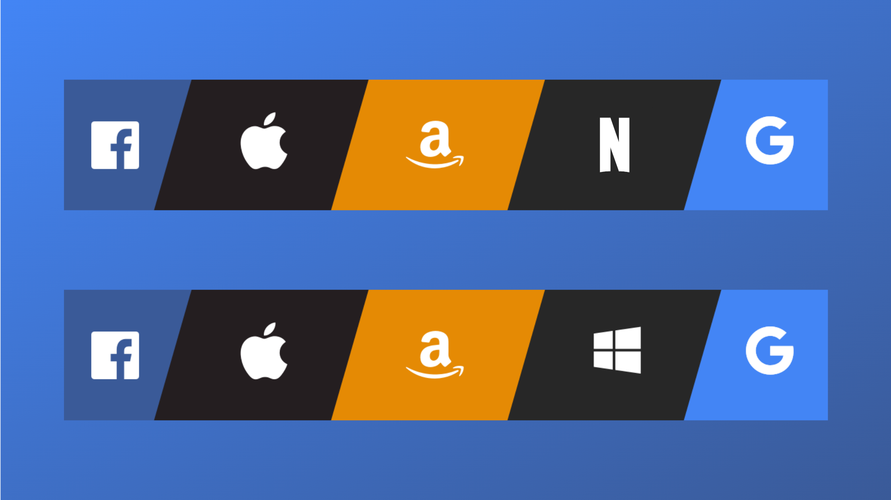

### What does FAANG/M stand for?

**F**acebook, **A**pple, **A**mazon, **N**etflix, **G**oogle and **M**icrosoft are the technology giants that comprise the popular acronym **FAANG** or **FAAMG** or **FAANGM**.

### The General Perception

Most people in the tech community have a perception that these are _"the best employers with good pay and great perks"_ and hence every fresher coming out of college dreams of joining one of these FAANGM companies. If you're one of those people who think this is true, then let me break it to you that this acronym has nothing to do with tech, nothing at all.

### So what does it really mean?

The term comes from stock market point of view and was coined by Jim Cramer, the television host of CNBC's Mad Money, in 2013, who thought these companies were totally dominant in their markets and had grown exponentially in the stock markets during that time.

Originally, the term FANG was used, without Apple being included in it. Later, in 2017, when Apple's stock had made larger gains, it was added and the term became FAANG.

### Why Microsoft is/isn't included?

Microsoft wasn't performing anywhere near to these companies and hence it hadn't made it to this acronym. However, after the appointment of Satya Nadella as the CEO of Microsoft in 2014, the company showed massive growth and its stock almost quadrupled from 2014 to 2019. This compelled the stock market experts to squeeze in Microsoft in the acronym. Later in 2019, Goldman Sachs came up with FAAMG, replacing Netflix with Microsoft. It chose to do so because of Netflix's relatively small market capitalisation compared to the others. Also, FAAMG is somewhat more focused on tech companies as Netflix is considered to be a consumer services and media company.

### Conclusion

FAANG or FAAMG might be thought of as best employers to work for but that wasn’t the case when it was coined, and it isn’t the case today either.

Thank you very much for reading this article and if you found it useful, please do share it with your friends or anyone who may find this interesting.

Connect with me on [Twitter](https://twitter.com/desaihetav) and [LinkedIn](https://linkedin.com/in/desaihetav) to get updates on my new blog posts.
